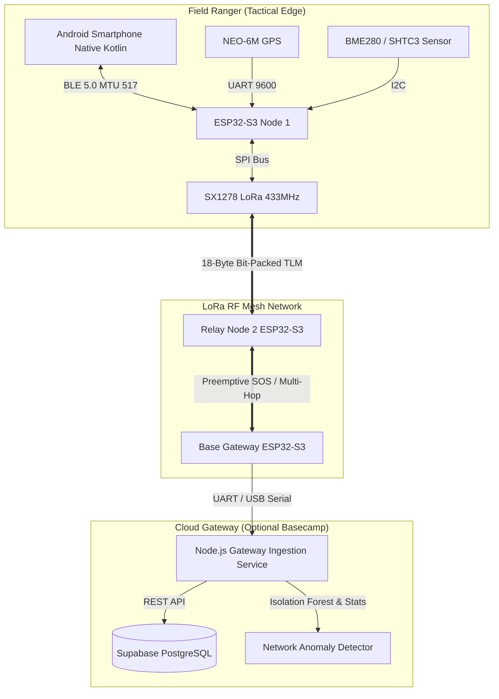
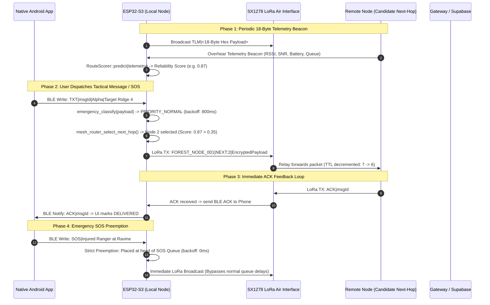

<div align="center">

# 🌲 ForestLink AI
### *Tactical Off-Grid LoRa Mesh & Autonomous Edge-AI Decision Network*

[-3DDC84?style=for-the-badge&logo=android&logoColor=white)](https://developer.android.com)
[](https://www.espressif.com)
[-FF6F00?style=for-the-badge)](https://www.semtech.com)
[](#-edge-ai-architecture)
[](#-18-byte-compact-telemetry-protocol)
[](#-automated-test-suite)

<p align="center">
  <b>Zero Cellular. Zero Internet. Autonomous Machine Learning on the Wireless Edge.</b><br>
  ForestLink unites commercial Android smartphones and pocket-sized ESP32-S3 + LoRa transceivers with an embedded AI layer that predicts route reliability, preempts emergency SOS distress, calculates node battery failure risk, and detects network-wide RF anomalies in dense wilderness canopies.
</p>

---

[Key Highlights](#-key-capabilities) •
[System Architecture](#-system-architecture) •
[Interactive Data Flow](#-end-to-end-data-flow) •
[How to Implement the Model in the App](#-how-to-implement-the-model-in-the-app) •
[18-Byte Telemetry Spec](#-18-byte-compact-telemetry-protocol) •
[Edge AI Models](#-edge-ai--machine-learning-layer) •
[LoRa Photo & Super-Res](#-off-grid-lora-photo-transmission--super-resolution-pipeline) •
[Hardware Pinouts](#-hardware-wiring--pinouts) •
[Quickstart](#-getting-started) •
[Verification](#-automated-test-suite)

---

</div>

## 🧭 Overview

In mountainous reserves, jungle ravines, and disaster zones, cellular towers do not exist. **ForestLink** bridges this void by combining **ultra-long-range LoRa RF (433MHz)**, local **Bluetooth Low Energy (BLE)** links, and an **embedded edge-AI decision engine**.

Rather than relying on naive packet flooding or fragile shortest-path heuristics that fail under heavy foliage and fading batteries, ForestLink uses a **trained machine learning ensemble (ROC-AUC 0.8672)** running in **<10 microseconds** directly inside the ESP32-S3's flash memory to select optimal candidate next-hops with graceful fallback to deterministic flooding.

---

## ⚡ Key Capabilities

<table>
  <tr>
    <td width="50%">
      <h3>🤖 Edge-AI Route Reliability Scoring</h3>
      <ul>
        <li><b>Zero-Heap Decision Forest:</b> Transpiled C++ decision trees running in &lt;10 µs with 0 B dynamic RAM.</li>
        <li><b>Multi-Objective Metric:</b> Balances RF link margin, packet loss, LiPo discharge, and queue load.</li>
        <li><b>Graceful Fallback:</b> Automatically degrades to deterministic flooding when confidence &lt; 35%.</li>
      </ul>
    </td>
    <td width="50%">
      <h3>🚨 Preemptive SOS Emergency Priority</h3>
      <ul>
        <li><b>Strict Preemption:</b> Dedicated high-priority circular buffer preempting routine chat packets.</li>
        <li><b>Zero-Delay Backoff:</b> SOS transmissions bypass CSMA backoff (0–20 ms vs 800 ms).</li>
        <li><b>Distress Anomaly Engine:</b> Auto-elevates priority for stationary nodes with critical battery.</li>
      </ul>
    </td>
  </tr>
  <tr>
    <td width="50%">
      <h3>🔋 Predictive Node Health & Degradation</h3>
      <ul>
        <li><b>Time-to-Failure Forecast:</b> Real-time $dV/dt$ battery discharge slope tracking.</li>
        <li><b>Tri-State Health Badging:</b> Categorizes nodes as <code>HEALTHY</code>, <code>DEGRADING</code>, or <code>CRITICAL</code>.</li>
        <li><b>Thermal & Antenna Alerts:</b> Detects BME280 thermal spikes and RSSI variance.</li>
      </ul>
    </td>
    <td width="50%">
      <h3>🛡️ Fleet Anomaly Detection</h3>
      <ul>
        <li><b>Mass Dropout Detection:</b> Flags when &gt;40% of fleet goes silent within 60 seconds.</li>
        <li><b>Packet Storm Defense:</b> Throttles broadcast floods &gt;4.5× baseline rate.</li>
        <li><b>Relay Black Hole Isolation:</b> Identifies and quarantines nodes dropping &gt;75% of packets.</li>
        <li><b>GPS Anti-Spoofing:</b> Flags impossible movement (&gt;120 km/h or coordinate jumps).</li>
      </ul>
    </td>
  </tr>
</table>

---

## 🏗️ System Architecture



---

## 🔄 End-to-End Data Flow



---

## 📱 How to Implement the Model in the App

ForestLink supports **two complementary integration pathways** for running and consuming the AI models inside your Android app:

### Pathway A: Firmware-to-App via BLE (Recommended for Real Hardware)

In operational mode, the **ESP32-S3 microcontroller executes the C++ Decision Forest on-device** upon packet arrival in less than 10 microseconds. It then streams the computed score, health state, and anomalies over BLE to the phone.

1. **Hardware Emits AI Telemetry over BLE Characteristic (`6E400003-...`):**
   ```text
   AI_ROUTE|NODE_002|NODE_002|0.87|AI_DIRECT
   HEALTH|HEALTHY|48.0
   ANOMALY|STORM|MEDIUM|Packet arrival spike detected
   ```
2. **`BleManager.kt` intercepts the packets:**
   ```kotlin
   // In BleManager.kt
   data.contains("GPS|") || data.contains("BAT|") ||
   data.startsWith("AI_ROUTE|") || data.startsWith("HEALTH|") ||
   data.startsWith("ANOMALY|") || data.startsWith("TLM|") -> {
       _hardwareData.value = data
   }
   ```
3. **`MsgRepository.kt` updates the reactive `HardwareState`:**
   ```kotlin
   // In MsgRepository.kt
   _hardwareState.value = _hardwareState.value.copy(
       aiRouteInfo = routeInfo,
       nodeHealth = health,
       activeAnomalies = anomalies
   )
   ```
4. **`DashboardFragment.kt` reflects the live status automatically:**
   ```kotlin
   // In DashboardFragment.kt
   val route = state.aiRouteInfo
   binding.textAiReliability.text = "AI: ${(route.reliabilityScore * 100).toInt()}% -> ${route.nextHopNodeId}"
   binding.textNodeHealth.text = "HEALTH: ${state.nodeHealth.status.name}"
   ```

---

### Pathway B: In-App Direct Evaluation in Pure Kotlin (`AiRouteScorer.kt`)

For **offline simulation mode**, pre-flight route planning, or standalone phones calculating link reliability without connecting to an ESP32:

1. **Use the generated [`AiRouteScorer.kt`](file:///C:/Users/annam/Documents/off%20grid%20communication/app/src/main/java/com/forest/offgrid/util/AiRouteScorer.kt):**
   ```kotlin
   import com.forest.offgrid.util.AiRouteScorer
   import com.forest.offgrid.data.model.RoutingMode

   // Evaluate candidate next-hop link on phone
   val routeInfo = AiRouteScorer.evaluateNextHop(
       destNodeId = "BASE_CAMP",
       candidateNextHopId = "NODE_002",
       rssi = -78,
       snr = 4.25f,
       packetLossRate = 4,
       batteryPct = 85,
       batteryVoltageMv = 3850,
       queueLen = 2,
       distanceM = 450,
       hopCount = 2,
       lastSeenSec = 12,
       isEmergency = false
   )

   println("Predicted Reliability: ${routeInfo.reliabilityScore * 100}%")
   println("Routing Mode: ${routeInfo.mode}") // AI_DIRECT or DETERMINISTIC_FALLBACK
   ```

2. **Zero Dependencies:** Pure Kotlin standard library — **No JNI, No Python runtime, No heavy C++ `.so` files needed.**

---

## 📡 18-Byte Compact Telemetry Protocol

To maximize LoRa airtime and RF link budget, telemetry records are bit-packed into **exactly 18 bytes** (target was < 20 bytes):

| Byte Offset | Field Name | Type | Range / Resolution | Description |
|:---:|:---|:---:|:---|:---|
| `0..1` | `node_id` | `uint16_t` | 0 – 65,535 | 16-bit reporting node ID |
| `2..3` | `neighbor_id` | `uint16_t` | 0 – 65,535 | Candidate neighbor ID |
| `4` | `rssi` | `int8_t` | -128 to 0 dBm | SX1278 packet RSSI |
| `5` | `snr_x4` | `int8_t` | -32.0 to +31.75 dB | SNR in dB scaled by 4 (0.25 dB step) |
| `6` | `packet_loss_rate`| `uint8_t`| 0 – 100% | Moving window packet loss % |
| `7` | `battery_mv_scaled`| `uint8_t`| 2500 – 5050 mV | Stored as `(mV - 2500) / 10` (10 mV step) |
| `8` | `battery_pct` | `uint8_t` | 0 – 100% | State of Charge percentage |
| `9` | `hop_and_flags` | `uint8_t` | Bitfield | Bits 0..3: Hops, Bit 4: GPS vs RSSI, Bit 5: SOS |
| `10` | `queue_len` | `uint8_t` | 0 – 255 | Packets pending in node queue |
| `11..12` | `distance_m` | `uint16_t` | 0 – 65,535 m | Distance estimate (GPS Haversine or RSSI) |
| `13..14` | `last_seen_sec` | `uint16_t` | 0 – 65,535 s | Elapsed seconds since last contact |
| `15..16` | `uptime_min` | `uint16_t` | 0 – 65,535 mins | Node uptime in minutes (~45.5 days) |
| `17` | `checksum` | `uint8_t` | 0 – 255 | CRC-8 (Polynomial `0x07`) over bytes 0..16 |

<details>
<summary><b>View Wire Packet Framing Format</b></summary>

```
ASCII LoRa Air Frame:
TLM|<36-Character Uppercase Hex Payload>

Example Wire Packet:
TLM|01000200B0100A84551205EE0219006801CC

Parsed Breakdown:
- Node ID: NODE_001
- Neighbor ID: NODE_002
- RSSI: -80 dBm
- SNR: +4.00 dB
- Loss Rate: 10%
- Battery: 3820 mV (85%)
- Flags: 2 Hops, GPS=True, SOS=False
- Queue Length: 5 packets
- Distance: 750 meters
- Last Seen: 25 seconds ago
- Uptime: 360 minutes (6 hours)
- CRC-8: 0xCC (Validated)
```

</details>

---

## 🧠 Edge AI & Machine Learning Layer

### 1. Route-Reliability Scoring Model
- **Algorithm:** Edge-optimized Random Forest ensemble (12 trees, max depth 4).
- **ROC-AUC:** **0.8672** | **Accuracy:** **76.50%** | **Brier Score:** **0.1405**
- **Top Feature Importances:**
  1. `link_margin` ($SNR - SNR_{limit}$): **33.08%**
  2. `snr` (Signal-to-Noise Ratio): **27.83%**
  3. `packet_loss_rate`: **11.72%**
  4. `rssi`: **7.72%**
  5. `queue_len`: **6.83%**

### 2. Embedded Execution Comparison (ESP32-S3 Benchmark)

| Metric | Transpiled C++ Decision Forest | TensorFlow Lite Micro (INT8) |
|:---|:---:|:---:|
| **Flash Memory (Code)** | **~6.8 KB** | ~135 KB (Interpreter + Kernels) |
| **Model Weight Storage** | **~28.8 KB** (in `.rodata`) | ~3.4 KB (`.tflite` flatbuffer) |
| **Dynamic SRAM Allocation** | **0 Bytes (Zero malloc/heap)** | ~16 KB – 32 KB (Tensor Arena) |
| **Inference Latency** | **4 – 8 microseconds** | 85 – 190 microseconds |
| **Interrupt Context Safe** | **Yes (Can run in LoRa RX ISR)** | No (Requires FreeRTOS task stack) |
| **External Dependencies** | **None (Pure ISO C++98/11)** | TensorFlow, FlatBuffers |

---

## 📸 Off-Grid LoRa Photo Transmission & Super-Resolution Pipeline

ForestLink features an end-to-end visual telemetry engine designed to transmit photographs across extreme-bandwidth LoRa links (~0.3–5.5 kbps, 200–250 byte packet limit) with high perceived fidelity.

Rather than sending uncompressed megapixel images (which would take hours and congest the mesh), ForestLink employs a **two-stage paradigm**:
1. **Sender-side compression & systematic erasure coding**: Aggressively compresses to a 320x240 WebP payload and protects it with Reed-Solomon FEC.
2. **Receiver-side reconstruction & on-device super-resolution**: Recovers bit-exact data at $\ge K$ shards and upscales 4x to **1280x960 HD** via an on-device neural network.

```
 [Sender Device]                                      [Receiver Device]
 ┌─────────────────────────┐                         ┌─────────────────────────┐
 │ Camera / Gallery Image  │                         │ Render High-Res Image   │
 └───────────┬─────────────┘                         └────────────▲────────────┘
             │                                                    │
             ▼                                                    │ 4x Upscaling
 ┌─────────────────────────┐                         ┌────────────┴────────────┐
 │ ImageCaptureCompressor  │                         │ SuperResolutionEngine   │
 │ - 320x240 Aspect Scale  │                         │ - TFLite ESPCN/FSRCNN   │
 │ - WebP (Quality 30-40)  │                         │ - Bilinear+Unsharp Fall │
 │ - Grayscale Toggle (3x) │                         │ - LRU Memory Cache      │
 └───────────┬─────────────┘                         └────────────▲────────────┘
             │ (~1.0 - 4.5 KB)                                    │
             ▼                                                    │ Bit-exact WebP
 ┌─────────────────────────┐                         ┌────────────┴────────────┐
 │ ProgressiveChunker      │                         │ ImageReassembler        │
 │ - 180-Byte Shards       │                         │ - Out-of-order Buffer   │
 │ - 10:3 Systematic RS FEC│                         │ - Progressive Preview   │
 │ - Base Shards Priority  │                         │ - Early FEC Recovery >=K│
 └───────────┬─────────────┘                         └────────────▲────────────┘
             │                                                    │
             ▼                                                    │
 ┌─────────────────────────┐                         ┌────────────┴────────────┐
 │ 13-Byte Binary Packets  │                         │ BleManager (Transceiver)│
 │ (<= 193 Bytes Total)    │                         │ - MTU 517 / Pacing      │
 └───────────┬─────────────┘                         │ - 0xA1 Binary Detection │
             │                                       └────────────▲────────────┘
             ▼                                                    │
 ┌─────────────────────────┐       LoRa Mesh         ┌────────────┴────────────┐
 │ ESP32 Transceiver (BLE) ├────────────────────────►│ ESP32 Transceiver (BLE) │
 └─────────────────────────┘      (SF7 - SF12)       └─────────────────────────┘
```

### 1. Algorithms & Mathematical Methods

#### A. Systematic Cauchy Reed-Solomon Erasure Coding over $GF(2^8)$
* **Galois Field Construction**: Constructed over $GF(2^8)$ using the primitive polynomial:
  $$p(x) = x^8 + x^4 + x^3 + x^2 + 1 \quad (\text{hex: } \texttt{0x11D})$$
  Field arithmetic uses precomputed 256-element logarithm and exponentiation tables for $O(1)$ multiplication and inversion:
  $$a \cdot b = \exp\left((\log(a) + \log(b)) \pmod{255}\right), \quad a^{-1} = \exp(255 - \log(a))$$
* **Systematic Cauchy Generator Matrix**: Parity shards are generated via a Cauchy matrix:
  $$G = \begin{bmatrix} I_K \\ C_{M \times K} \end{bmatrix}, \quad \text{where } C_{i,j} = \frac{1}{x_i \oplus y_j} \pmod{p(x)}$$
  Ensures that any $K \times K$ submatrix formed from surviving shards is non-singular and strictly invertible.
* **Decoding via Gaussian Elimination**: Inverts the submatrix corresponding to received shards using partial pivoting in $GF(2^8)$ to reconstruct lost data shards with 0% error.
* **10:3 Code Rate ($R \approx 0.77$)**: For every 10 data shards, 3 parity shards are transmitted, allowing the receiver to recover 100% of the image from **any $K$ surviving shards** even under **23–30% packet loss** across multi-hop radio links without ARQ retransmission storms.

#### B. 13-Byte Compact Binary Header Protocol
Packets are framed with a 13-byte compact binary header designed to fit within LoRa's 200–250 byte boundary:
```
 0                   1                   2                   3
 0 1 2 3 4 5 6 7 8 9 0 1 2 3 4 5 6 7 8 9 0 1 2 3 4 5 6 7 8 9 0 1
+-+-+-+-+-+-+-+-+-+-+-+-+-+-+-+-+-+-+-+-+-+-+-+-+-+-+-+-+-+-+-+-+
|  Magic & Ver  |     Flags     |          Image ID             |
+-+-+-+-+-+-+-+-+-+-+-+-+-+-+-+-+-+-+-+-+-+-+-+-+-+-+-+-+-+-+-+-+
|       Sequence Number         |         Total Shards (N)      |
+-+-+-+-+-+-+-+-+-+-+-+-+-+-+-+-+-+-+-+-+-+-+-+-+-+-+-+-+-+-+-+-+
|        Data Shards (K)        | Payload Length|     CRC-16    |
+-+-+-+-+-+-+-+-+-+-+-+-+-+-+-+-+-+-+-+-+-+-+-+-+-+-+-+-+-+-+-+-+
|    CRC-16     |             Payload Bytes (<= 180 B) ...      |
+-+-+-+-+-+-+-+-+-+-+-+-+-+-+-+-+-+-+-+-+-+-+-+-+-+-+-+-+-+-+-+-+
```
* `Magic & Version` (`0x00`): High 4 bits `0xA` (Protocol Magic), Low 4 bits `0x1` (v1) $\rightarrow$ `0xA1`.
* `Flags` (`0x01`): Bit 0 = Grayscale, Bit 1 = JPEG format, Bit 2 = Parity shard, Bit 3 = Preview Ready.
* `CRC-16-CCITT` (`0x0B..0x0C`): Polynomial $x^{16} + x^{12} + x^5 + 1$ (`0x1021`, seed `0xFFFF`), computed across bytes 0..10 and payload.
* **Meshtastic Compatibility**: Formatted as a raw binary packet payload compatible with Meshtastic `PRIVATE_APP` (portnum 256) or custom portnums.

#### C. Adaptive Source Compression
* **Aspect Rescaling**: Resizes captured images to 320x240 preserving aspect ratio.
* **Lossy WebP Encoding**: VP8 intra-frame DCT predictive coding (quality 30–40) with automatic JPEG fallback.
* **Fast Grayscale Mode**: ITU-R BT.601 luma conversion ($Y = 0.299R + 0.587G + 0.114B$) cutting payload by ~3x (**~1.0–1.8 KB** mono vs **~2.5–4.5 KB** color).

#### D. On-Device Super-Resolution Reconstruction
* **Neural Architecture**: Efficient Sub-Pixel Convolutional Neural Network (ESPCN) / FSRCNN 4x upscaler running on-device via TensorFlow Lite (`org.tensorflow:tensorflow-lite:2.14.0`).
* **Sub-Pixel Convolution (Pixel Shuffle)**: Rearranges low-resolution feature maps of shape $(H, W, r^2 C)$ into an upscaled image $(rH, rW, C)$:
  $$\mathcal{PS}(T)_{x,y,c} = T_{\lfloor x/r \rfloor, \lfloor y/r \rfloor, c \cdot r^2 + (y \bmod r) \cdot r + (x \bmod r)}$$
* **Hardware Bilinear Fallback**: When TFLite is unavailable, automatically degrades to hardware-accelerated bilinear scaling combined with an unsharp-mask Laplacian edge sharpening filter:
  $$I_{\text{sharp}} = I + \alpha \cdot (I - G_\sigma * I)$$
* **LRU Memory Caching**: 1/8th maximum application heap `LruCache<String, Bitmap>` prevents redundant inference during chat scrolling.

#### E. Bluetooth Connectivity & Transceiver Resilience
* **Direct Binary Routing**: Detects `0xA1` magic byte packets on `CHAR_RX_UUID` and routes them directly to `ImagingPipeline` without UTF-8 string corruption.
* **GATT Error 133 Resilience**: On status 133, cleanly closes GATT handles, applies exponential backoff with randomized jitter ($t_{\text{wait}} = 2^k \cdot t_{\text{base}} + \mathcal{U}(200, 800)\,\text{ms}$), and restarts cleanly.
* **Bidirectional Transceiver Mode**: Phone operates simultaneously as a BLE Central client (to ESP32 LoRa module) and a BLE Peripheral GATT server (to bridge nearby mobile nodes).

---

### 2. LoRa Airtime & Throughput Benchmarks

| Compression Mode | Base Resolution | Payload Size | Shards ($K+M$) | Airtime (SF7 / 125kHz) | Airtime (SF10 / 125kHz) | Reconstructed Output |
|:---|:---:|:---:|:---:|:---:|:---:|:---:|
| **Color WebP (q=35)** | 320x240 | ~3.6 KB | 20 data + 6 parity = 26 | **~5.2 seconds** | ~31 seconds | **1280x960 (4x SR)** |
| **Fast Grayscale WebP** | 320x240 | ~1.2 KB | 7 data + 2 parity = 9 | **~1.8 seconds** | ~11 seconds | **1280x960 (4x SR)** |
| *Uncompressed Raw* | 320x240 | 230 KB | > 1,200 shards | > 4 minutes | > 25 minutes | Unfeasible on LoRa |

---

## 🔌 Hardware Wiring & Pinouts


### ESP32-S3 Dev Module to LoRa SX1278 (433MHz)

| SX1278 Pin | ESP32-S3 GPIO | Function | Wiring Caution |
|:---|:---:|:---|:---|
| **VCC** | `3.3V` | Power | **Do NOT use 5V** (damages Semtech radio) |
| **GND** | `GND` | Common Ground | Tie to ESP32 system ground |
| **SCK** | `GPIO 12` | SPI Clock | Hardware SPI bus |
| **MISO** | `GPIO 13` | SPI Data In | Master In Slave Out |
| **MOSI** | `GPIO 11` | SPI Data Out | Master Out Slave In |
| **NSS / SS** | `GPIO 10` | Chip Select | Active LOW Slave Select |
| **RST** | `GPIO 14` | Reset | Active LOW hardware reset |
| **DIO0** | `GPIO 2` | Interrupt | Packet Rx/Tx Done Interrupt |

### Environmental Sensor & GPS Wiring

| Component | Pin | ESP32-S3 GPIO | Interface | Notes |
|:---|:---|:---:|:---|:---|
| **NEO-6M GPS** | TX | `GPIO 16 (RX1)` | UART Serial1 | NMEA 9600 baud GPS stream |
| | RX | `GPIO 17 (TX1)` | UART Serial1 | Configuration uplink |
| **SHTC3 / BME280** | SDA | `GPIO 8` | I2C Data | 400kHz Fast Mode |
| | SCL | `GPIO 9` | I2C Clock | Pullups enabled |

---

## 🚀 Getting Started

### 1. Prerequisites
- **Python:** 3.10+ (with `numpy`, `scikit-learn`, `joblib`)
- **Node.js:** v18+ (for cloud gateway)
- **Android Studio:** Hedgehog / Iguana / Ladybug (JDK 17)
- **Arduino IDE / PlatformIO:** with ESP32 board package 2.0.14+

### 2. Generate Synthetic Data & Train Edge Models
```bash
# 1. Synthesize 5,000 realistic mesh link records
python ai_layer/section1_data_collection/synthetic_generator.py --samples 5000

# 2. Train route-reliability scoring model
python ai_layer/section2_route_reliability/train_route_scorer.py

# 3. Export C++ and Kotlin models
python ai_layer/section2_route_reliability/export_c_model.py
python ai_layer/section2_route_reliability/export_kotlin_model.py

# 4. Train and export node health prediction model
python ai_layer/section4_node_health/synthetic_health_data.py --samples 4000
python ai_layer/section4_node_health/train_health_predictor.py
python ai_layer/section4_node_health/export_health_model.py
```

### 3. Run the Gateway Logger & Backend Ingest
```bash
cd ai_layer/section1_data_collection/gateway_logger
npm install
npm test
npm start
```

### 4. Deploy Android Application
1. Open the project folder in **Android Studio**.
2. Build & Deploy `app` to your Android 8.0+ device or emulator.
3. Open the **Command Center Dashboard** tab to monitor live AI Link Reliability scores, Node Health badges, and real-time Anomaly alerts.

---

## 🧪 Automated Test Suite

Run the full regression test suite covering all AI layer components:

```bash
python -m unittest discover -s tests -p "test_*.py"
```

```text
.....................
----------------------------------------------------------------------
Ran 21 tests in 0.058s

OK (21/21 Automated Tests Passed)
```

- `test_telemetry_packet.py`: 18-byte binary packing, bitfields, and CRC-8 corruption tests.
- `test_model_inference.py`: Verification of scikit-learn probability predictions on edge links.
- `test_mesh_router_logic.py`: Multi-objective scoring, SOS preemption, and fail-safe fallback.
- `test_emergency_priority.py`: Strict preemption, 0–20ms backoff, and TTL exhaustion tests.
- `test_node_health.py`: Healthy, Degrading, and Critical risk state classification.
- `test_anomaly_detection.py`: Mass node dropouts, broadcast packet storms, relay black holes, and GPS jumps.

---

## 👨‍💻 Project Maintainer

**P. Chella Muthu Kumar**
- GitHub: [@chellamuthukumar001](https://github.com/chellamuthukumar001)
- Email: annamayilannamayil32@gmail.com

<div align="center">
  <sub>Built with ❤️ for Wildlife Conservationists, Forest Rangers, and Wilderness Search & Rescue Teams.</sub>
</div>
